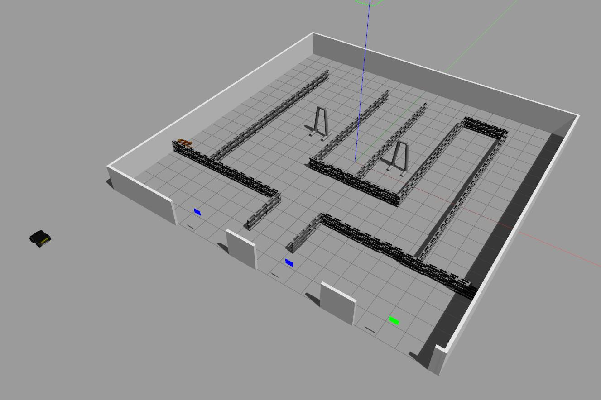

# erl_simulations
ROS Package for the ERL competitions (include worlds and models)

## Setup models
Not sure if the package will export correctly the path of models. Executes the script setup_model.sh if you have an error.

` catkin_make install ` can be used.

## Launch files

- erl_static  : world with the maze made of static pallets
- erl_chaos  : same as above with random pallet falling from 5m
- erl_w_randy : same as erl_static with one randy sitting in a corner
- erl_w_randys: same as erl_static with multiples randys

For randy, be sure to use the provide model with orange texture.
